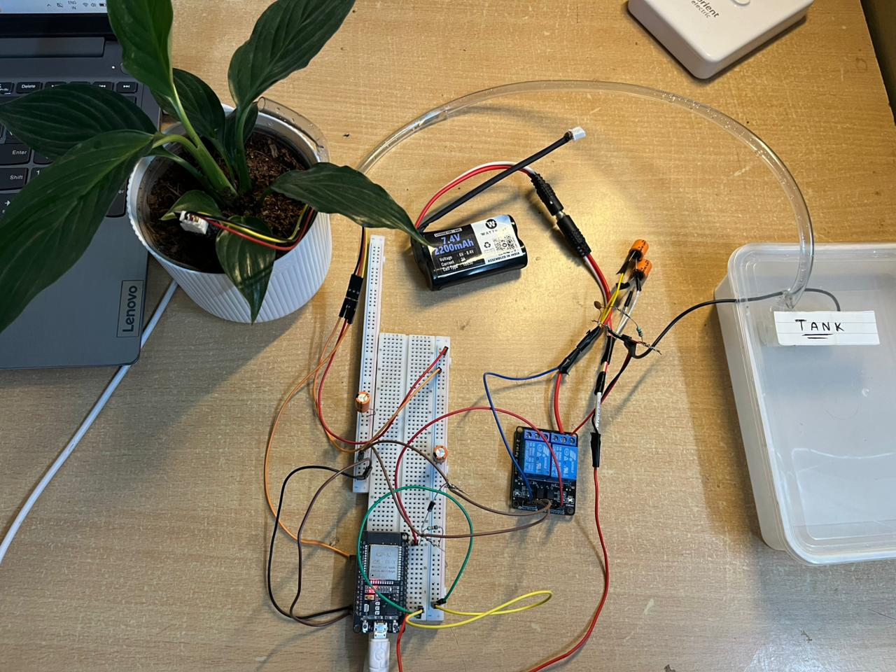
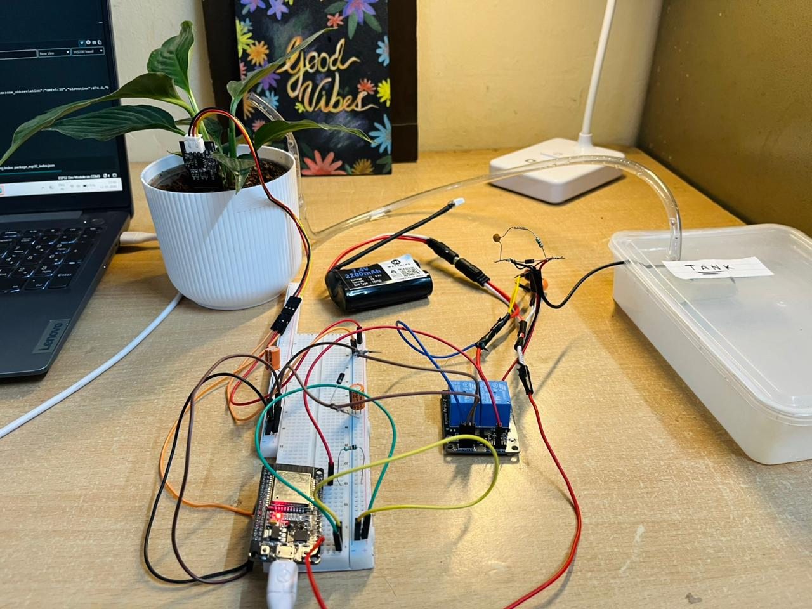
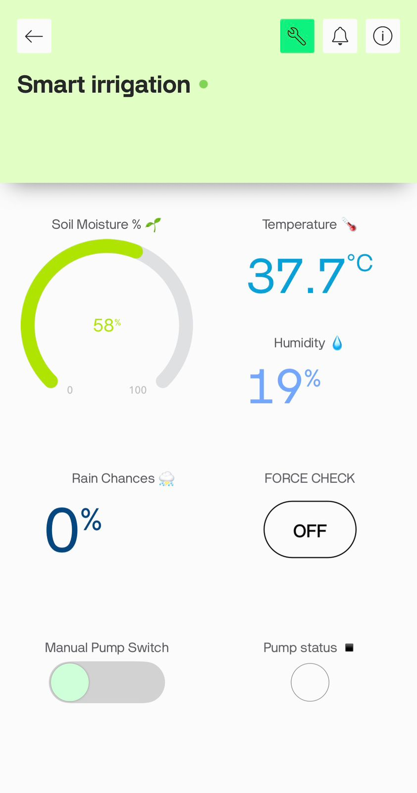
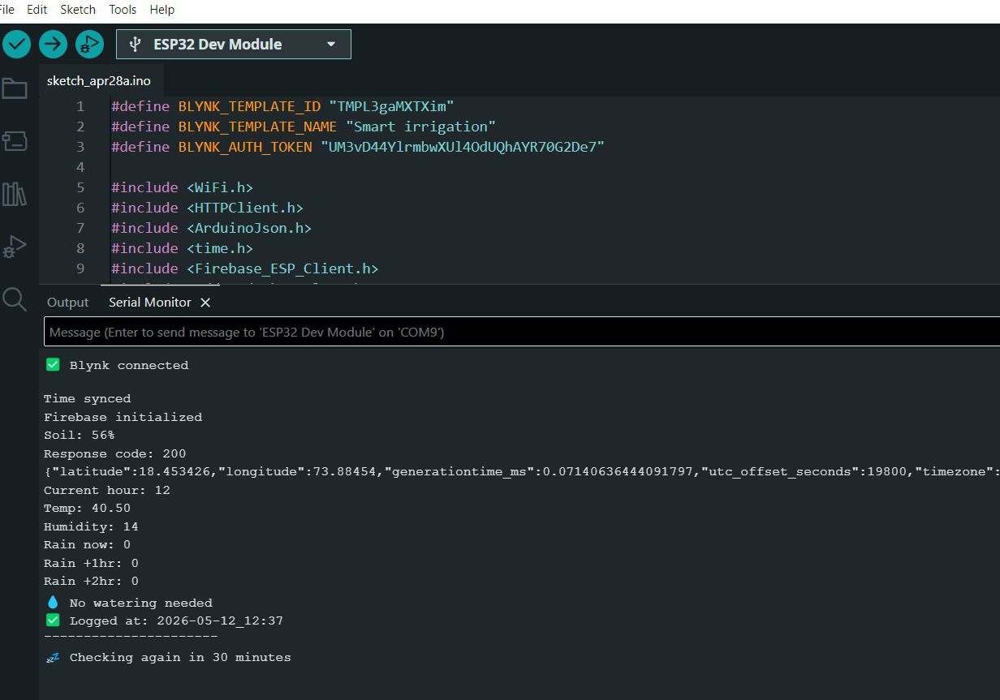
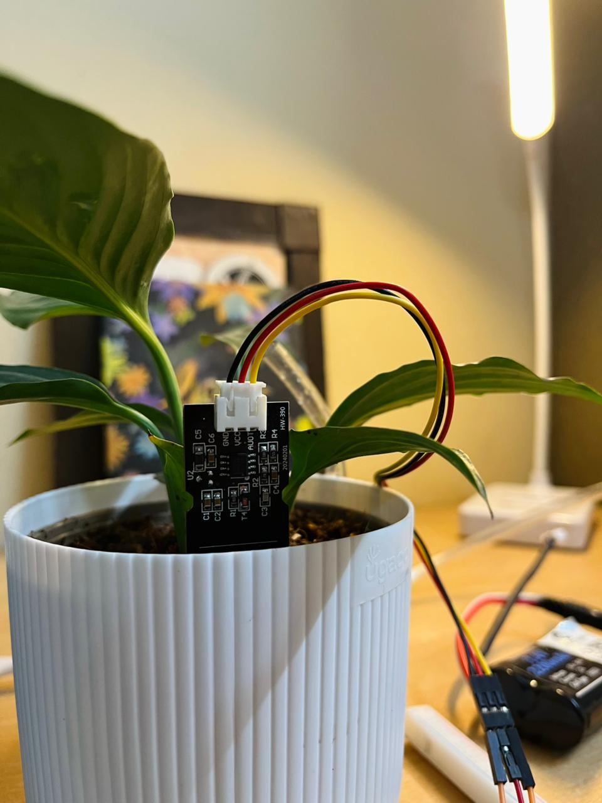

# Smart Irrigation System using ESP32

An IoT-based Smart Irrigation System built using ESP32 that automates plant watering based on real-time soil moisture levels and weather conditions.  
The system provides remote monitoring through a live web dashboard and mobile app.

---

## Live Dashboard
[View Dashboard] (https://sourrabhhh199.github.io/smart-irrigation)

---

## Features
- Real-time soil moisture monitoring with percentage display
- Automatic pump control using relay module
- Smart irrigation logic based on weather conditions
- Real-time weather data integration using Open-Meteo API
- Firebase Realtime Database logging with timestamps
- Live monitoring and alerts using Blynk IoT
- Web dashboard hosted using GitHub Pages
- Manual pump control from mobile and web dashboard
- No-WiFi fallback mode for uninterrupted operation
---

## Hardware Components
- ESP32 Development Board
- Capacitive Soil Moisture Sensor
- 2-Channel Relay Module (Optocoupler Based)
- Mini/Submersible Water Pump
- 7.4V Battery
- Connecting Wires

---

## Tech Stack
- Arduino (C++)
- Firebase Realtime Database
- Blynk IoT Platform
- Open-Meteo Weather API
- GitHub Pages
- HTML, CSS, JavaScript

---

## System Working
The soil moisture sensor continuously monitors soil conditions and sends data to the ESP32.

Based on:
- current soil moisture level
- weather forecast data
- predefined threshold values

the system decides whether to:
- fully water the plants
- partially water the plants
- skip watering to save water

All sensor data and system status are displayed in real time on:
- Blynk mobile application
- GitHub-hosted web dashboard

---

## Repository Structure

```text
.
├── index.html      # Web dashboard
├── main.ino        # ESP32 firmware
└── README.md
```

---

## Setup Instructions

1. Clone this repository
2. Open `main.ino` in Arduino IDE
3. Install all required libraries
4. Add your Wi-Fi, Firebase, and Blynk credentials
5. Select ESP32 board and COM port
6. Upload the code to ESP32

---

## Libraries Used
- Firebase ESP Client
- Blynk
- ArduinoJson
- WiFi
- HTTPClient

---

## Future Improvements
- AI-based irrigation prediction
- Solar-powered operation
- Multiple zone irrigation support
- Mobile push notifications
- Water usage analytics

---

## Project Images

### Final Hardware Setup


### Complete Irrigation Setup


### Blynk Mobile Dashboard


### Serial Monitor Output


### Plant Monitoring


---
## Author
Sourabh
